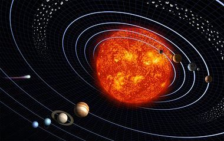
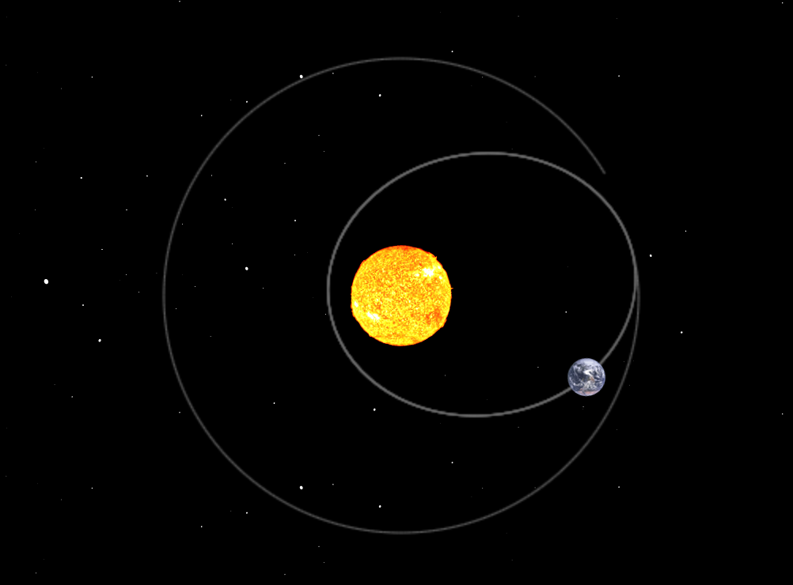
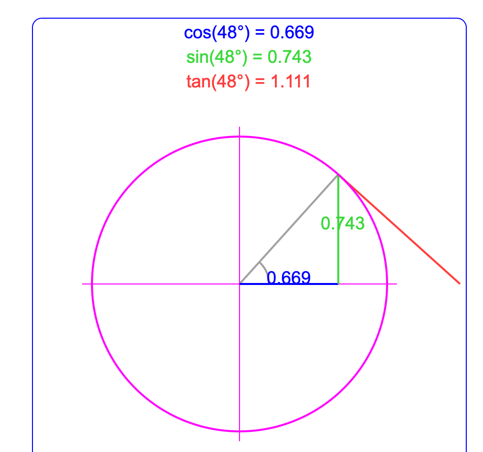

# Sluneční soustava

---

# Aristotelés

---

# Galileo Galilei

---

# Johannes Kepler

---

# Isaac Newton

---

[Simulace](https://evgenii.com/blog/earth-orbit-simulation/)

---

# Pohyb po kružnici

---

# Pohyb po kružnici

Úhel jsme si pojmenovali jako $M$. Vzdálenost Země od Slunce pak označíme jako $r$.

$$ x = r \times \cos(M) $$

$$ y = r \times \sin(M) $$

---

# Odkazy

* [Pohyb po kružnici]()
* [Simulace Slunce a Země](https://evgenii.com/blog/earth-orbit-simulation/)
